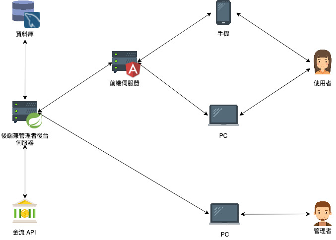

# 第3章 系統規格

## 3-1 系統架構
<<<<<<< Updated upstream

 
圖 3-1-1 系統架構圖

 
圖 3-1-2 系統功能架構圖

## 3-2 系統軟、硬體需求與技術平台
表 3-2-1 伺服器端規格表
| 伺服器端規格 |  |
| --- | --- |
| 作業系統 | Windows Server 2012 R2 Datacenter |
| 開發環境 | Windows 10 |
| 整合式開發環境(IDE) | IntelliJ IDEA 2020.2 |
| 程式語言 | Java 11 |
| 框架 | Spring Boot 2.3.1 |
| 套件管理 | Gradle |
| 伺服器 | Apache Tomcat 9.0.35 Server |
| 資料庫 | MySQL |

表 3-2-2 網頁端規格表
| 網頁端規格 |  |
| --- | --- |
| 作業系統 | Heroku (Ubuntu 18.04) |
| 開發環境 | macOS 10.15.6, Node.js 12.18.3 |
| 整合式開發環境(IDE) | WebStorm 2020.2, Visual Studio Code 1.48.2 |
| 程式語言 | TypeScript 3.9.5 |
| 框架 | Angular 10.0.8 |
| 套件管理 | NPM |

## 3-3 使用標準與工具
表 3-3-1 使用工具表
| 開發輔助工具 |  |
| --- | --- |
| 編輯器 | IntelliJ IDEA, WebStorm, Visual Studio Code |
| 資料庫管理工具 | MySQL Workbench, DataGrip |
| 版本控制工具 | Git |
| API 測試工具 | Postman |
| API 文件 | Swagger |
| 文件撰寫工具 |  |
| 文件製作 | Microsoft Word 2019 |
| 簡報製作 | Microsoft PowerPoint 2019 |
| UML 工具 | Visual Paradigm for UML 7.2 Enterprise Edition |
| 介面設計工具 |  |
| 雛形設計 | Adobe XD |
| 製圖工具 | Adobe Photoshop, Adobe Illustrator |
| 專案管理工具 |  |
| 溝通工具 | LINE, Telegram |
| 版本控管 | GitHub |
| 進度追蹤 | Trello |
| 影片軟體 |  |
| 剪輯軟體 | Adobe Premiere Pro |