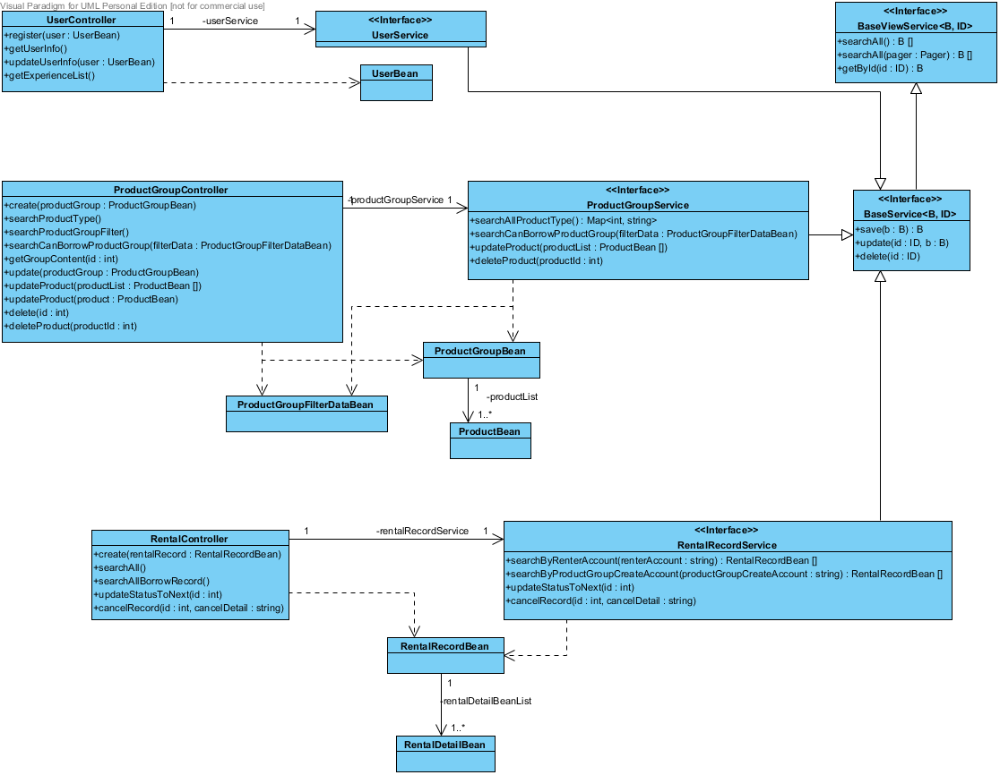

# 第5章 需求模型

## 5-1 使用者需求
功能性需求：
使用者 : 
  交易相關 : 針對商品進行上架、租借、出租、付款、取消。
  帳號相關 : 針對使用者資料進行查看、修改，修改密碼。
  回報相關 : 針對問題進行回報。
管理者 : 
  使用者管理 : 針對使用者進行查詢、封鎖、解封。 
  訂單管理 : 針對訂單進行查詢、修改。
  回報問題管理 : 針對回報進行查詢、回覆。

非功能性需求：
裝置需求：具有chrome、firefox等瀏覽器 、WiFi/3G/4G/5G 無線網路、有線網路。

## 5-2 使用個案圖

## 5-3 使用個案描述

## 5-4 分析類別圖

  
   
  圖5-4-1分析類別圖
