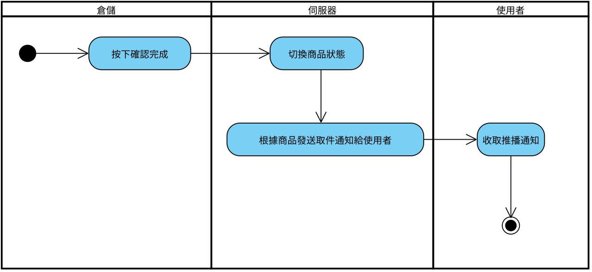
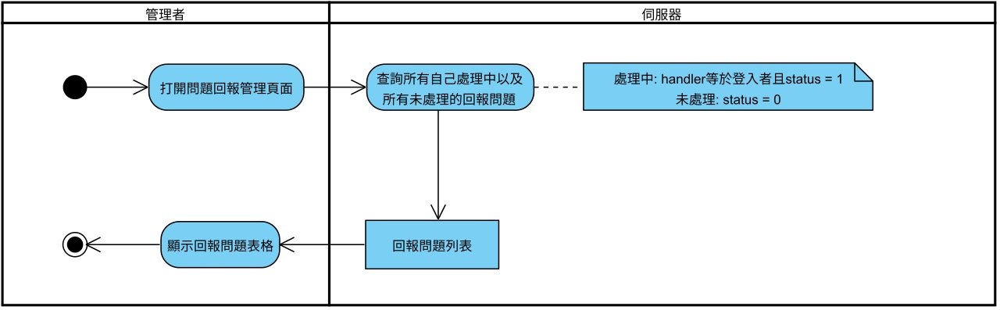

# 第5章 需求模型

## 5-1 使用者需求
- 功能性需求：
  - 使用者 : 
    - 交易相關 : 針對商品進行上架、租借、出租、付款、取消。
    - 帳號相關 : 針對使用者資料進行查看、修改，修改密碼。
    - 回報相關 : 針對問題進行回報。
  - 管理者 : 
    - 使用者管理 : 針對使用者進行查詢、封鎖、解封。 
    - 訂單管理 : 針對訂單進行查詢、修改。
    - 回報問題管理 : 針對回報進行查詢、回覆。

- 非功能性需求：
裝置需求：具有Chrome、Firefox等瀏覽器 、WiFi/3G/4G/5G 無線網路、有線網路。

## 5-2 使用個案圖

 
圖 5-2-1 使用個案圖

## 5-3 使用個案描述

 
圖 5-3-1 驗證之活動圖

 
圖 5-3-2 註冊之活動圖

 
圖 5-3-3 登入之活動圖

 
圖 5-3-4 忘記密碼之活動圖

 
圖 5-3-5 修改密碼之活動圖

 
圖 5-3-6 物品送達推播之活動圖

 
圖 5-3-7 建議租金之活動圖

 
圖 5-3-8 提出租借請求之活動圖

 
圖 5-3-9 通知推播之活動圖

 
圖 5-3-10 付款之活動圖

 
圖 5-3-11 物品上架之活動圖

 
圖 5-3-12 問題回報之活動圖

 
圖 5-3-13 物品寄放之活動圖

 
圖 5-3-14 物品取件之活動圖

 
圖 5-3-15 取消交易之活動圖

 
圖 5-3-16 物品歸還之活動圖

 
圖 5-3-17 物品領回之活動圖

 
圖 5-3-18 回報之問題管理之活動圖

 
圖 5-3-19 管理者處理回報問題之活動圖

 
圖 5-3-20 賠償申請之活動圖

## 5-4 分析類別圖

 
圖 5-4-1 分析類別圖