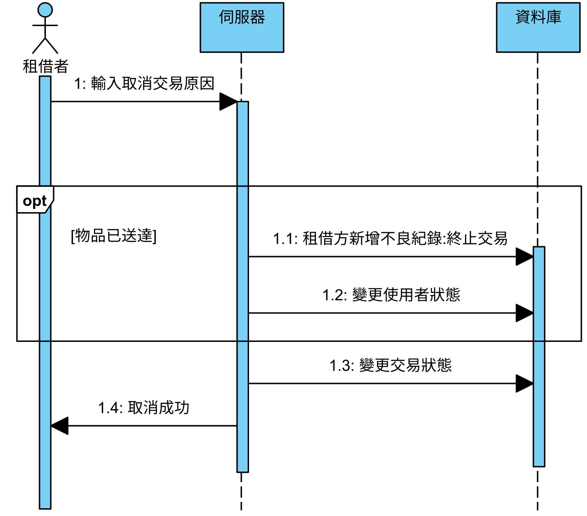

# 第6章 設計模型

## 6-1 循序圖

 
圖 6-1-1 驗證之循序圖

 
圖 6-1-2 註冊之循序圖

 
圖 6-1-3 登入之循序圖

 
圖 6-1-4 忘記密碼之循序圖

 
圖 6-1-5 修改密碼之循序圖

 
圖 6-1-6 通知產生之循序圖

 
圖 6-1-7 建議租金產生之循序圖

 
圖 6-1-8 租借之循序圖

 
圖 6-1-9 付款之循序圖

 
圖 6-1-10 問題回報之循序圖

 
圖 6-1-11 物品上架之循序圖

 
圖 6-1-12 物品寄放之循序圖

 
圖 6-1-13 物品領取之循序圖

 
圖 6-1-14 物品歸還之循序圖

 
圖 6-1-15 物品領回之循序圖

 
圖 6-1-16 回報問題管理之循序圖

 
圖 6-1-17 管理者處理回報問題之循序圖

 
圖 6-1-18 租借方取消交易之循序圖

 
圖 6-1-19 出租方取消交易之循序圖

 
圖 6-1-20 賠償之循序圖

## 6-2 設計類別圖

 
圖 6-2-1 設計類別圖