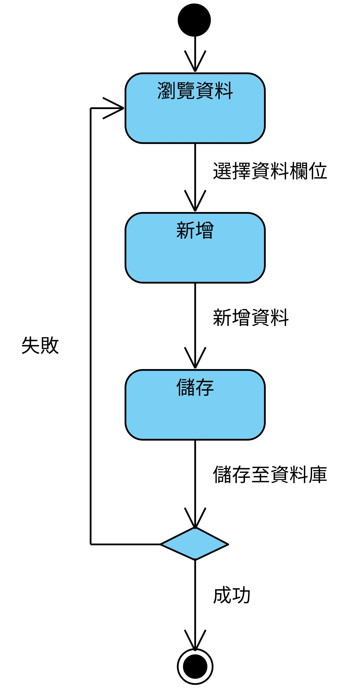

# 第7章 實作模型

## 7-1 佈署圖

 
圖 7-1 部署圖

## 7-2 套件圖

 
圖 7-2 套件圖

## 7-3 元件圖

 
圖 7-3 元件圖

## 7-4 狀態機

 
圖 7-4-1 登入狀態機

 
圖 7-4-2 驗證狀態機

 
圖 7-4-3 查詢狀態機

 
圖 7-4-4 新增狀態機

 
圖 7-4-5 修改狀態機

 
圖 7-4-6 刪除狀態機

 
圖 7-4-7 商品租借狀態機