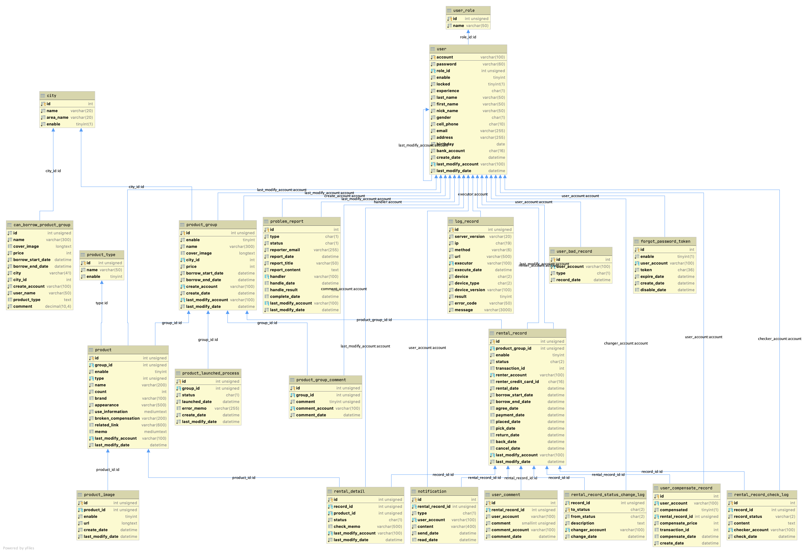

# 第8章 資料庫設計

## 8-1 資料庫關聯圖

  
   
  圖 8-1-1 資料庫關聯圖

## 8-2 表格及其Meta data

表 8-2-1 user_role - 使用者權限
| 欄位名稱 |   意義   |    型態     | 空值 | 主鍵 | 預設值 |      規則      |
|:--------:|:--------:|:-----------:|:----:|:----:|:------:|:--------------:|
|    id    |   編號   |   int(11)   |      |  V   |        | auto_increment |
|   name   | 權限名稱 | varchar(50) |      |      |        |                |

表 8-2-2 user - 使用者
|      欄位名稱       |                意義                 |     型態     | 空值 | 主鍵 |      預設值       |        規則         |
|:-------------------:|:-----------------------------------:|:------------:|:----:|:----:|:-----------------:|:-------------------:|
|       account       |             使用者帳號              |   int(11)    |      |  V   |                   |   auto_increment    |
|      passowrd       |             使用者密碼              | varchar(60)  |      |      |                   |                     |
|       role_id       |             使用者權限              |   int(11)    |      |      |         3         |                     |
|       enable        |    是否啟用(0: 不啟用/ 1: 啟用)     |  tinyint(4)  |      |      |         1         |                     |
|     experience      | 露營經驗(0: 新手/ 1: 有過幾次經驗)  |   char(1)    |      |      |         0         |                     |
|      last_name      |             使用者姓氏              | varchar(50)  |      |      |                   |                     |
|     first_name      |             使用者名稱              | varchar(50)  |      |      |                   |                     |
|      nick_name      |             使用者暱稱              | varchar(50)  |      |      |                   |                     |
|       gender        | 使用者性別(0: 男/ 1: 女/ 2: 未提供) |   char(1)    |      |      |                   |                     |
|        email        |              電子信箱               | varchar(255) |      |      |                   |                     |
|       address       |             使用者住址              | varchar(255) |      |      |                   |                     |
|      birthday       |                生日                 |     date     |      |      |                   |                     |
|     create_date     |           最後修改者帳號            |   datetime   |      |      | CURRENT_TIMESTAMP |                     |
| last_modify_account |           最後修改者帳號            | varchar(100) |      |      |                   | 參照：user(account) |
|  last_modify_date   |            最後修改時間             |   datetime   |      |      | CURRENT_TIMESTAMP |                     |

表 8-2-3 log_record - 使用者操作紀錄
|    欄位名稱    |                                                           意義                                                            |     型態     | 空值 | 主鍵 |      預設值       |      規則      |
|:--------------:|:-------------------------------------------------------------------------------------------------------------------------:|:------------:|:----:|:----:|:-----------------:|:--------------:|
|       id       |                                                         流水編號                                                          |   int(11)    |      |  V   |                   | auto_increment |
| server_version |                                                        伺服器版本                                                         | varchar(20)  |      |      |                   |                |
|       ip       |                                                        使用者IPv4                                                         |   char(19)   |      |      |                   |                |
|     method     |                                                     發送請求時的方法                                                      |  varchar(6)  |      |      |                   |                |
|      url       |                                                           網址                                                            | varchar(500) |      |      |                   |                |
|    executor    |                                                        使用者帳號                                                         | varchar(100) |      |      |                   |                |
|  execute_date  |                                                         操作日期                                                          |   datetime   |      |      | CURRENT_TIMESTAMP |                |
|     device     |                          使用設備(-1: Unknown/ 00: Postman/ 01: 瀏覽器/ 02: App瀏覽器/ 03: App)                           |   char(1)    |      |      |                   |                |
|  device_type   | 設備類型(-1: Unknown/ 00: Postman/ 01: IE/ 02: Edge/ 03: Chrome/ 04:FireFox/ 05: Safari/ 06: Opera/ 07: Android/ 08: iOS) |   char(1)    |      |      |                   |                |
| device_version |                                                         設備版本                                                          |   int(11)    |      |      |                   |                |
|     result     |                                                         執行結果                                                          |   int(11)    |      |      |                   |                |
|   error_code   |                                                         錯誤代碼                                                          |   int(11)    |      |      |                   |                |
|    message     |                                                         回應訊息                                                          |   int(11)    |      |      |                   |                |

表 8-2-4 city - 可租借城市
| 欄位名稱  |             意義             |    型態     | 空值 | 主鍵 | 預設值 | 規則 |
|:---------:|:----------------------------:|:-----------:|:----:|:----:|:------:|:----:|
|   name    |  城市名稱，如臺北市、宜蘭縣  | varchar(20) |      |  V   |        |      |
| area_name |   區名稱，如中正區、宜蘭市   | varchar(20) |      |  V   |        |      |
|  enable   | 是否啟用(0: 不啟用/ 1: 啟用) | tinyint(4)  |      |      |   1    |      |

表 8-2-5 user_comment - 使用者評價
|    欄位名稱     |        意義        |     型態     | 空值 | 主鍵 |      預設值       |        規則         |
|:---------------:|:------------------:|:------------:|:----:|:----:|:-----------------:|:-------------------:|
|       id        |      流水編號      |   int(11)    |      |  V   |                   |   auto_increment    |
|  user_account   | 被評價的使用者帳號 | varchar(100) |      |      |                   | 參照：user(account) |
|     comment     |    評價(0 ~ 5)     |   int(11)    |      |      |                   |                     |
| comment_account |     評價者帳號     | varchar(100) |      |      |                   | 參照：user(account) |
|  comment_date   |      流水編號      |   datetime   |      |      | CURRENT_TIMESTAMP |                     |

表 8-2-6 problem_report - 問題回報
|      欄位名稱       |                 意義                  |     型態     | 空值 | 主鍵 |      預設值       |        規則         |
|:-------------------:|:-------------------------------------:|:------------:|:----:|:----:|:-----------------:|:-------------------:|
|         id          |               流水編號                |   int(11)    |      |  V   |                   |   auto_increment    |
|        type         |               問題類型                |   char(1)    |      |      |                   |                     |
|       status        | 狀態(0: 未處理/ 1: 處理中/ 2: 已完成) |   char(1))   |      |      |                   |                     |
|   reporter_email    |              回報者信箱               | varchar(255) |      |      |                   |                     |
|   report_content    |               回報內容                |     text     |      |      |                   |                     |
|     report_date     |               回報日期                |   datetime   |      |      |                   |                     |
|       handler       |              處理人帳號               | varchar(100) |  V   |      |                   | 參照：user(account) |
|    handle_result    |               處理結果                |     text     |  V   |      |                   |                     |
|     handle_date     |               處理日期                |   datetime   |  V   |      |                   |                     |
| last_modify_account |            最後修改人帳號             | varchar(100) |      |      |                   | 參照：user(account) |
|  last_modify_date   |             最後修改日期              |   datetime   |      |      | CURRENT_TIMESTAMP |                     |

表 8-2-7 product_type - 商品類型
| 欄位名稱 |             意義             |    型態     | 空值 | 主鍵 | 預設值 |      規則      |
|:--------:|:----------------------------:|:-----------:|:----:|:----:|:------:|:--------------:|
|    id    |           流水編號           |   int(11)   |      |  V   |        | auto_increment |
|   name   |           類型名稱           | varchar(50) |      |      |        |                |
|  enable  | 是否啟用(0: 不啟用/ 1: 啟用) | tinyint(4)  |      |      |   1    |                |

表 8-2-8 product_group - 商品群組
|      欄位名稱       |             意義             |     型態     | 空值 | 主鍵 |      預設值       |            規則             |
|:-------------------:|:----------------------------:|:------------:|:----:|:----:|:-----------------:|:---------------------------:|
|         id          |           流水編號           |   int(11)    |      |  V   |                   |       auto_increment        |
|       enable        | 是否啟用(0: 不啟用/ 1: 啟用) |  tinyint(4)  |      |      |         1         |                             |
|    bank_account     |           匯款帳戶           |   char(16)   |      |      |                   |                             |
|        name         |         商品群組名稱         | varchar(300) |      |      |                   |                             |
|     cover_image     |            封面圖            |     text     |  V   |      |                   |                             |
|      city_name      |  城市名稱，如臺北市、宜蘭縣  | varchar(20)  |      |      |                   | 參照：city(name, area_name) |
|   city_area_name    |   區名稱，如中正區、宜蘭市   | varchar(20)  |      |      |                   | 參照：city(name, area_name) |
|        price        |           租借價格           |   int(11)    |      |      |                   |                             |
|  borrow_start_date  |       可租借的起始時間       |   datetime   |      |      |                   |                             |
|   borrow_end_date   |       可租借的結束時間       |   datetime   |      |      |                   |                             |
|   create_account    |          建立者帳號          | varchar(100) |      |      |                   |     參照：user(account)     |
|     create_date     |           建立時間           |   datetime   |      |      | CURRENT_TIMESTAMP |                             |
| last_modify_account |        最後修改者帳號        | varchar(100) |      |      |                   |     參照：user(account)     |
|  last_modify_date   |         最後修改時間         |   datetime   |      |      | CURRENT_TIMESTAMP |                             |

表 8-2-9 product - 商品
|      欄位名稱       |             意義             |     型態     | 空值 | 主鍵 |      預設值       |          規則           |
|:-------------------:|:----------------------------:|:------------:|:----:|:----:|:-----------------:|:-----------------------:|
|         id          |           流水編號           |   int(11)    |      |  V   |                   |     auto_increment      |
|      group_id       |         商品群組編號         |   int(11)    |      |      |                   | 參照：product_group(id) |
|       enable        | 是否啟用(0: 不啟用/ 1: 啟用) |  tinyint(4)  |      |      |         1         |                         |
|        type         |           商品類型           |   int(11)    |      |      |                   | 參照：product_type(id)  |
|        name         |           商品名稱           | varchar(200) |      |      |                   |                         |
|        count        |             數量             |   int(11)    |      |      |                   |                         |
|        brand        |             品牌             | varchar(100) |  V   |      |                   |                         |
|     appearance      |           外觀狀況           | varchar(500) |      |      |                   |                         |
|   use_information   |           使用方式           |  mediumtext  |      |      |                   |                         |
| broken_compensation |           損壞賠償           | varchar(200) |      |      |                   |                         |
|    related_link     |           相關連結           | varchar(600) |  V   |      |                   |                         |
|        memo         |             備註             |  mediumtext  |  V   |      |                   |                         |
| last_modify_account |        最後修改者帳號        | varchar(100) |      |      |                   |   參照：user(account)   |
|  last_modify_date   |         最後修改時間         |   datetime   |      |      | CURRENT_TIMESTAMP |                         |

表 8-2-10 product_image - 商品圖
|     欄位名稱     |             意義             |    型態    | 空值 | 主鍵 |      預設值       |       規則        |
|:----------------:|:----------------------------:|:----------:|:----:|:----:|:-----------------:|:-----------------:|
|        id        |           流水編號           |  int(11)   |      |  V   |                   |  auto_increment   |
|    product_id    |           商品編號           |  int(11)   |      |      |                   | 參照：product(id) |
|      enable      | 是否啟用(0: 不啟用/ 1: 啟用) | tinyint(4) |      |      |         1         |                   |
|       url        |           圖片網址           |    text    |      |      |                   |                   |
|   create_date    |           建立時間           |  datetime  |      |      | CURRENT_TIMESTAMP |                   |
| last_modify_date |         最後修改時間         |  datetime  |      |      | CURRENT_TIMESTAMP |                   |

表 8-2-11 product_launched_process - 商品群組上架紀錄表
|     欄位名稱     |                  意義                   |     型態     | 空值 | 主鍵 |      預設值       |          規則           |
|:----------------:|:---------------------------------------:|:------------:|:----:|:----:|:-----------------:|:-----------------------:|
|        id        |                流水編號                 |   int(11)    |      |  V   |                   |     auto_increment      |
|     group_id     |              商品群組編號               |   int(11)    |      |      |                   | 參照：product_group(id) |
|      status      | 執行狀態(0: 未執行/ 1: 已執行/ 2: 失敗) |   char(1)    |      |      |         0         |                         |
|  launched_date   |                上架時間                 |   datetime   |      |      |                   |                         |
|    error_memo    |                錯誤紀錄                 | varchar(255) |  V   |      |                   |                         |
|   create_date    |                建立時間                 |   datetime   |      |      | CURRENT_TIMESTAMP |                         |
| last_modify_date |              最後修改時間               |   datetime   |      |      | CURRENT_TIMESTAMP |                         |

表 8-2-12 product_group_comment - 商品群組評價
|    欄位名稱     |     意義     |     型態     | 空值 | 主鍵 |      預設值       |        規則         |
|:---------------:|:------------:|:------------:|:----:|:----:|:-----------------:|:-------------------:|
|       id        |   流水編號   |   int(11)    |      |  V   |                   |   auto_increment    |
|    group_id     | 商品群組編號 |   int(11)    |      |      |                   |  product_group(id)  |
|     comment     | 評價(0 ~ 5)  |   int(11)    |      |      |                   |                     |
| comment_account |  評價者帳號  | varchar(100) |      |      |                   | 參照：user(account) |
|  comment_date   |   流水編號   |   datetime   |      |      | CURRENT_TIMESTAMP |                     |

表 8-2-13 rental_record - 租借紀錄
|       欄位名稱        |                          意義                          |     型態     | 空值 | 主鍵 |      預設值       |          規則           |
|:---------------------:|:------------------------------------------------------:|:------------:|:----:|:----:|:-----------------:|:-----------------------:|
|          id           |                        流水編號                        |   int(11)    |      |  V   |                   |     auto_increment      |
|   product_group_id    |                    租借商品群組編號                    |   int(11)    |      |      |                   | 參照：product_group(id) |
|        enable         |              是否啟用(0: 不啟用/ 1: 啟用)              |  tinyint(4)  |      |      |         1         |                         |
|        status         | 狀態(0:取消/ 1: 未取貨/ 2:未歸還/ 3:已歸還/ 4: 已檢查) |   char(1)    |      |      |         1         |                         |
|    transaction_id     |                     信用卡交易編號                     |   int(11)    |      |      |                   |                         |
|    renter_account     |                       租借者帳號                       | varchar(100) |      |      |                   |   參照：user(account)   |
| renter_credit_card_id |             租借人的信用卡號(只顯示末四碼)             |   char(16)   |      |      |                   |                         |
|      rental_date      |             點選我要租借的時間，即建立時間             |   datetime   |      |      | CURRENT_TIMESTAMP |                         |
|   borrow_start_date   |                    預計租借起始時間                    |   datetime   |      |      |                   |                         |
|    borrow_end_date    |                    預計租借結束時間                    |   datetime   |      |      |                   |                         |
|       pick_date       |                        取貨時間                        |   datetime   |  V   |      |                   |                         |
|      return_date      |                        歸還時間                        |   datetime   |  V   |      |                   |                         |
|      check_date       |                        檢查時間                        |   datetime   |  V   |      |                   |                         |
|      cancel_date      |                        取消時間                        |   datetime   |  V   |      |                   |                         |
|     cancel_detail     |                        取消原因                        |     text     |  V   |      |                   |                         |
|  last_modify_account  |                     最後修改者帳號                     | varchar(100) |      |      |                   |   參照：user(account)   |
|   last_modify_date    |                      最後修改時間                      |   datetime   |      |      | CURRENT_TIMESTAMP |                         |

表 8-2-14 rental_detail - 租借詳細記錄
|      欄位名稱       |                     意義                     |     型態     | 空值 | 主鍵 |      預設值       |          規則           |
|:-------------------:|:--------------------------------------------:|:------------:|:----:|:----:|:-----------------:|:-----------------------:|
|         id          |                   流水編號                   |   int(11)    |      |  V   |                   |     auto_increment      |
|      record_id      |                 租借紀錄編號                 |   int(11)    |      |      |                   | 參照：rental_record(id) |
|     product_id      |                   商品編號                   |   int(11)    |      |      |                   |    參照：product(id)    |
|       status        | 狀態(0: 未歸還/ 1: 已歸還/ 2: 損壞/ 3: 遺失) |   char(1)    |      |      |         0         |                         |
|     check_memo      |                出借方檢查備註                | varchar(500) |      |  V   |                   |                         |
| last_modify_account |                最後修改者帳號                | varchar(100) |      |      |                   |   參照：user(account)   |
|  last_modify_date   |                 最後修改時間                 |   datetime   |      |      | CURRENT_TIMESTAMP |                         |

表 8-2-15 can_borrow_product_group - 可租借商品群組(View表)
|     欄位名稱      |                        意義                         |     型態     | 空值 |
|:-----------------:|:---------------------------------------------------:|:------------:|:----:|
|        id         |                      商品編號                       |   int(11)    |      |
|       name        |                    商品群組名稱                     | varchar(300) |      |
|    cover_image    |                       封面圖                        |     text     |  V   |
|       price       |                      租借價格                       |   int(11)    |      |
| borrow_start_date |                  可租借的起始時間                   |   datetime   |      |
|  borrow_end_date  |                  可租借的結束時間                   |   datetime   |      |
|       city        |   城市(為cirt_name + " " + city_area_name的結果)    | varchar(41)  |      |
|     city_name     |             城市名稱，如臺北市、宜蘭縣              | varchar(20)  |      |
|  city_area_name   |              區名稱，如中正區、宜蘭市               | varchar(20)  |      |
|     user_name     | 建立者姓名(為account + "(" + nick_name + ")"的結果) | varchar(152) |      |
|   product_type    |            所有商品類型，以","(逗號)隔開            |     text     |      |
